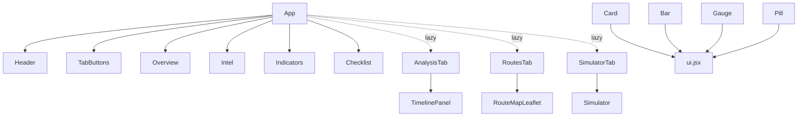
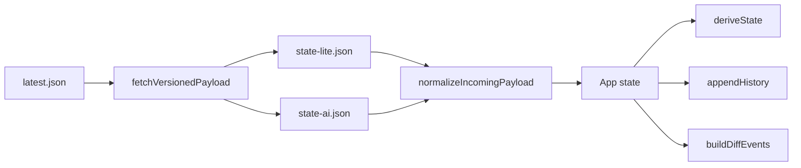

# Components

React SPA는 탭별로 무거운 UI를 분리하고, `App`이 pointer 기반 fetch와 lazy-load orchestration을 담당한다.

---

## 컴포넌트 계층

---

## 핵심 역할 분리

| 컴포넌트 | 파일 | 역할 |
|----------|------|------|
| App | `react/src/App.jsx` | fetch orchestration, tab state, history/timeline, overview/intel/indicator/checklist 렌더 |
| AnalysisTab | `react/src/components/AnalysisTab.jsx` | history charts + timeline panel |
| RoutesTab | `react/src/components/RoutesTab.jsx` | Leaflet map + route detail cards |
| SimulatorTab | `react/src/components/SimulatorTab.jsx` | wrapper for `Simulator` lazy-load |
| Simulator | `react/src/components/Simulator.jsx` | scenario simulator |
| RouteMapLeaflet | `react/src/components/RouteMapLeaflet.jsx` | route map, geometry fetch |
| TimelinePanel | `react/src/components/TimelinePanel.jsx` | timeline events |

---

## lazy-load 구조

`App.jsx`는 아래 컴포넌트를 `React.lazy(...)`로 import한다.

- `AnalysisTab`
- `RoutesTab`
- `SimulatorTab`

이 구조의 목적:

1. 초기 번들에서 차트/Leaflet/시뮬레이터 코드를 분리
2. routes 탭이 열리기 전까지 Leaflet mount 방지
3. analysis/sim 탭 관련 코드의 first paint 비용 축소

---

## 데이터 흐름

`App`은 `pointerStateRef`에 현재 `version`, `aiVersion`, raw snapshot을 보관하고, 변경이 있을 때만 필요한 payload를 다시 읽는다.

---

## 탭별 렌더 책임

| Tab | 주 렌더 위치 | 비고 |
|-----|--------------|------|
| overview | `App.jsx` | eager |
| intel | `App.jsx` | eager |
| indicators | `App.jsx` | eager |
| checklist | `App.jsx` | eager |
| analysis | `AnalysisTab.jsx` | lazy |
| routes | `RoutesTab.jsx` | lazy |
| sim | `SimulatorTab.jsx` | lazy |

---

## App 주요 상태

| 상태 | 용도 |
|------|------|
| `dash` | 정규화된 dashboard payload |
| `history` | 시계열 snapshot history |
| `timeline` | diff/noise-gated event log |
| `selectedRouteId` | routes 탭 선택 상태 |
| `summary` | offline summary 출력 |
| `pointerStateRef` | 현재 `version`, `aiVersion`, raw snapshot cache |

---

## AnalysisTab

파일: `react/src/components/AnalysisTab.jsx`

- 입력:
  - `history`
  - `derived`
  - `timeline`
  - `onClearHistory`
  - `onClearTimeline`
  - `onExportTimeline`
- 출력:
  - `MultiLineChart`
  - `Sparkline`
  - `TimelinePanel`

---

## RoutesTab

파일: `react/src/components/RoutesTab.jsx`

- 입력:
  - `dash`
  - `selectedRouteId`
  - `onSelectRoute`
  - `normalizeNewsRef`
  - `routeBufferFactor`
- 출력:
  - `RouteMapLeaflet`
  - route card list
  - related refs

`RouteMapLeaflet`는 routes 탭에서만 mount되므로 지도와 route geometry fetch가 초기 렌더에 포함되지 않는다.

---

## SimulatorTab

파일: `react/src/components/SimulatorTab.jsx`

- 역할:
  - `Simulator`를 lazy-load 대상 탭으로 분리하는 얇은 wrapper
- 입력:
  - `liveDash`
  - `onLog`

---

## 실시간 정보 반영

- Fast poll: `fetchVersionedPayload()` 우선, 실패 시 기존 fast candidate fallback
- Full sync: pointer 강제 재조회 후 fallback candidate 확인
- `applyDashboard(...)`: `dash`, `history`, `timeline`를 함께 갱신
- `deriveState(...)`: mode/gate/SLA/route 상태를 계산

---

## localStorage 유지 항목

| 키 | 설명 |
|----|------|
| `urgentdash.egressLossETA` | egress ETA 사용자 설정 |
| `urgentdash.history.v1` | history cache |
| `urgentdash.timeline.v1` | timeline cache |
| `urgentdash.autoSummary.v1` | auto summary toggle |

Checklist의 `done` 상태도 payload merge 시 로컬 상태를 우선 유지한다.
