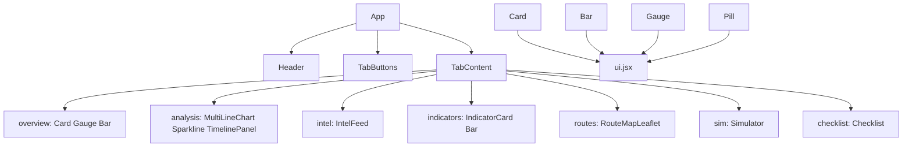
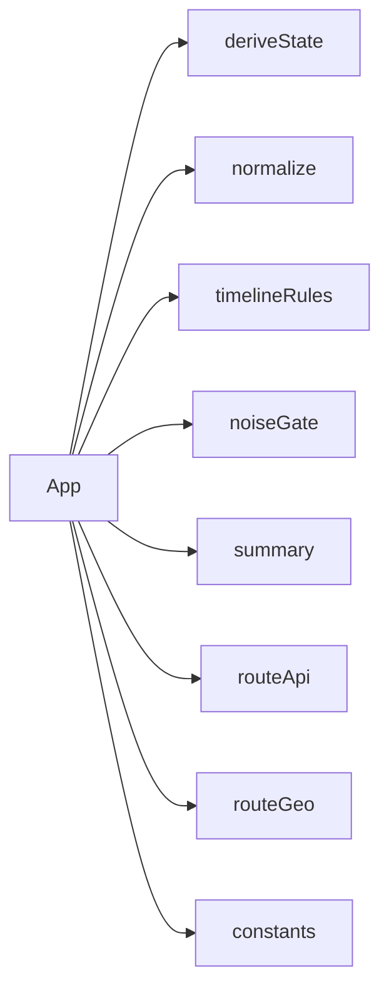
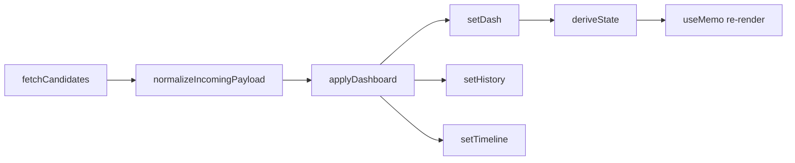

# Components

React 컴포넌트 계층, Props, 의존 관계, 실시간 정보 반영·동적 동작 로직.

---

## 컴포넌트 계층

---

## lib 의존성

| lib | 경로 | 역할 |
|-----|------|------|
| deriveState | `lib/deriveState.js` | dash → mode, gate, SLA, 점수 등 파생 |
| normalize | `lib/normalize.js` | API payload 정규화 |
| timelineRules | `lib/timelineRules.js` | appendHistory, buildDiffEvents, mkEvent |
| noiseGate | `lib/noiseGate.js` | mergeTimelineWithNoiseGate |
| summary | `lib/summary.js` | buildOfflineSummary |
| routeApi | `lib/routeApi.js` | OSRM route API |
| routeGeo | `lib/routeGeo.js` | Route geo resolution |
| constants | `lib/constants.js` | Polling, storage keys, dashboard URLs |

---

## 컴포넌트 테이블

| 컴포넌트 | 파일 | 설명 |
|----------|------|------|
| Card | `react/src/components/ui.jsx` | 컨테이너, `children`, `style` |
| Pill | `react/src/components/ui.jsx` | 라벨/값 pill |
| Bar | `react/src/components/ui.jsx` | 진행 바 (0~1) |
| Gauge | `react/src/components/ui.jsx` | 반원 게이지 |
| Sparkline | `react/src/components/charts.jsx` | 단일 시계열 미니 차트 |
| MultiLineChart | `react/src/components/charts.jsx` | 복수 시계열 차트 |
| RouteMapLeaflet | `react/src/components/RouteMapLeaflet.jsx` | Leaflet 루트 맵 |
| TimelinePanel | `react/src/components/TimelinePanel.jsx` | 이벤트 타임라인 |
| Simulator | `react/src/components/Simulator.jsx` | 시나리오 시뮬레이터 |

---

## 탭별 사용 컴포넌트

| Tab | 컴포넌트 |
|-----|----------|
| overview | Card, Gauge, Bar, Pill, conflict stats, Key Assumptions, AI Analysis, Summary |
| analysis | MultiLineChart, Sparkline, TimelinePanel |
| intel | Intel feed cards |
| indicators | Indicator cards + Bar |
| routes | RouteMapLeaflet + route cards |
| sim | Simulator |
| checklist | Checklist + Version history |

---

## 실시간 정보 반영·동적 동작 로직

### 데이터 소스·폴링

- **Fast Poll**: `fastPollMs` (기본 30초)마다 `fetchFastState()` → `getFastStateCandidates()` 순차 fetch
- **Full Sync**: `FULL_SYNC_INTERVAL_MS` (30분)마다 `fetchDashboard()` → `getDashboardCandidates()` 순차 fetch
- **쿼리**: `fetch(url + (sep)t=${Date.now()})` 캐시 무효화
- **실패 처리**: 연속 5회 실패 시 `logEvent`(WARN) + fallback 대시보드 유지

---

### 상태 흐름 (State Flow)

- `dash` (대시보드 payload) → `deriveState(dash, egressLossETA)` → `derived` (모드, 게이트, SLA, 점수 등)
- `applyDashboard` 시: `appendHistory`, `buildDiffEvents` → `mergeTimelineWithNoiseGate` → `setTimeline`

---

### 동적 반영되는 컴포넌트

| 컴포넌트 | 데이터 소스 | 갱신 트리거 |
|----------|-------------|-------------|
| Pill (Gate, SLA, I02, MODE) | `derived` | `dash` 변경 → `deriveState` → re-render |
| Gauge (EvidenceConf, ΔScore, Urgency) | `derived.ec`, `derived.ds`, `derived.urgencyScore` | 동일 |
| MultiLineChart | `history` (H0/H1/H2 시계열) | `applyDashboard` → `appendHistory` → `setHistory` |
| Sparkline | `history` (ds, ec 시계열) | 동일 |
| Intel feed cards | `dash.intel_feed` | `dash` 변경 |
| Indicator cards | `dash.indicators` | 동일 |
| Route cards | `dash.routes` | 동일 |
| TimelinePanel | `timeline` | `logEvent`, `buildDiffEvents` → `mergeTimelineWithNoiseGate` |
| Summary | `dash`, `derived` | `buildOfflineSummary`, `autoSummary` 시 `useEffect`로 dash 변경 시 자동 생성 |

---

### 실시간 요소

- **Ticker**: `setInterval(1000)` → `setNow(new Date())`, `setNextEta(p => p <= 0 ? fastCountdownSeconds : p - 1)` — 매초 `now`, `nextEta` 갱신
- **nextEta**: 다음 fast poll까지 남은 초 (countdown)
- **lastUpdated**: `fetchFastState`/`fetchDashboard` 성공 시 `new Date()` 저장
- **liveStale**: `derived.liveStale` — `liveLagSeconds > LIVE_STALE_THRESHOLD_SECONDS` (40분)이면 stale 표시

---

### 로컬 저장 (localStorage)

| 키 | 용도 |
|----|------|
| `urgentdash.egressLossETA` | egress ETA 사용자 설정 |
| `urgentdash.history.v1` | history (최대 HISTORY_MAX_POINTS) |
| `urgentdash.timeline.v1` | timeline (최대 TIMELINE_MAX) |
| `urgentdash.autoSummary.v1` | auto summary 토글 |

---

### Checklist

- `mergeChecklist`: payload의 checklist와 이전 `prev.checklist` 병합
- `done` 상태는 로컬 유지 (payload는 내용만 갱신)

---

## 컴포넌트별 Props·동작

### Card

- **Props**: `children`, `style`
- **동작**: 정적 컨테이너, dark card with border

### Pill

- **Props**: `label`, `value`, `color` (default `#94a3b8`)
- **동작**: 값에 따라 `color` prop 전달 (동적)

### Bar

- **Props**: `value` (0~1), `color` (default `#22c55e`), `h` (default 8)
- **동작**: `value` 변경 시 너비 동적 (`width: ${v * 100}%`)

### Gauge

- **Props**: `value`, `label`, `sub`
- **동작**: `value`에 따라 arc 색상·길이 동적 (`v>=0.8` red, `v>=0.4` amber, else green)

### Sparkline

- **Props**: `data`, `min`, `max`, `color` (default `#60a5fa`), `height` (default 44)
- **동작**: `data` 변경 시 path 재계산

### MultiLineChart

- **Props**: `series` (배열, 각 `{ id, label, color, data }`), `min`, `max`, `height` (default 160)
- **동작**: `series[].data` 변경 시 path 재계산
