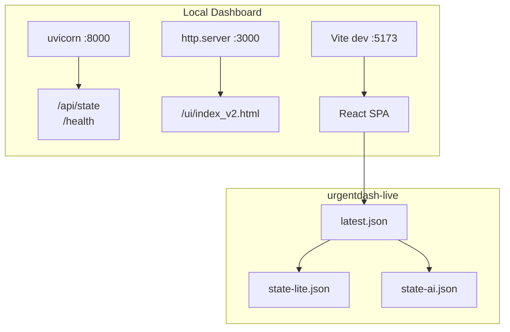
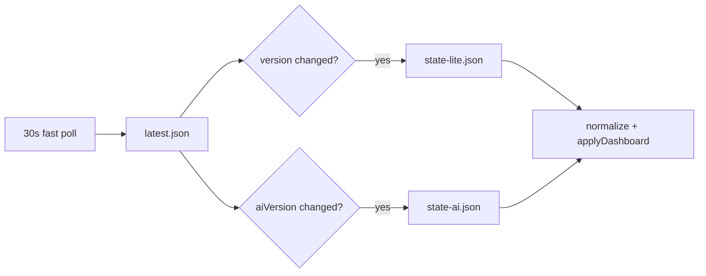
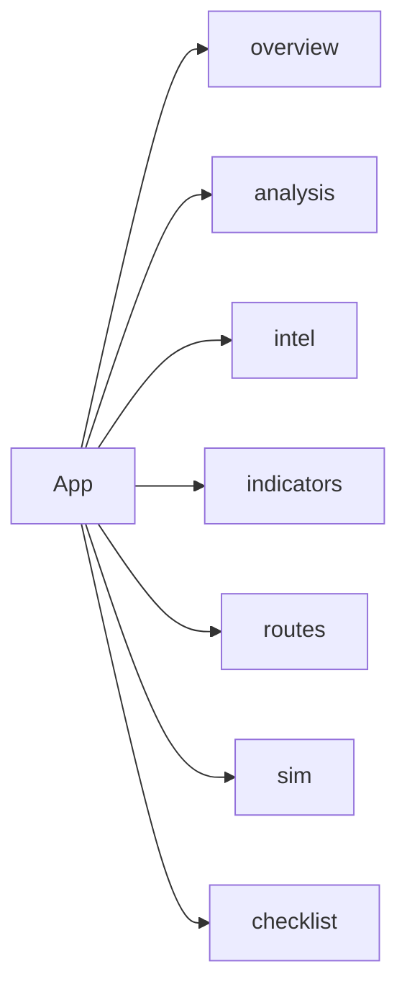

# Layout

React SPA를 canonical UI로 사용하며, 빠른 폴링은 `latest.json` pointer를 기준으로 동작한다.

---

## 서빙 아키텍처

---

## 데이터 fetch 구조

- Fast poll: `latest.json`만 조회
- `version` 변경 시: `state-lite.json` 재조회
- `aiVersion` 변경 시: `state-ai.json` 재조회
- 실패 시: 기존 `live/hyie_state.json` 및 `/api/state` 후보로 fallback

---

## 폴링 설정

| 항목 | 기본값 | 설명 |
|------|--------|------|
| Fast poll | 30초 | `latest.json` pointer 확인 |
| Full sync | 30분 | pointer 강제 재동기화 + fallback 후보 확인 |
| Countdown | 30초 | 다음 fast poll까지 남은 시간 |
| Stale threshold | 40분 | `derived.liveStale` 계산 기준 |

관련 상수는 `react/src/lib/constants.js`에 있다.

- `DEFAULT_LATEST_POINTER_CANDIDATES`
- `DEFAULT_FAST_STATE_CANDIDATES`
- `DEFAULT_DASHBOARD_CANDIDATES`

---

## URL 후보 순서

| 용도 | 기본 후보 |
|------|-----------|
| latest pointer | GitHub raw `live/latest.json` → `http://127.0.0.1:3000/live/latest.json` → `/live/latest.json` |
| fast/full fallback | GitHub raw `live/hyie_state.json` → `http://127.0.0.1:8000/api/state` → `/api/state` |

상대 경로는 `resolveRelativeUrl(...)`로 `latest.json` 기준에서 versioned 파일 URL로 변환한다.

---

## 탭 전환

라우터는 없고 `useState("overview")` 기반 탭 전환이다.

---

## Lazy-load 전략

초기 번들에서는 무거운 탭을 제외한다.

| 탭 | 로딩 방식 |
|----|-----------|
| overview | eager |
| intel | eager |
| indicators | eager |
| checklist | eager |
| analysis | `React.lazy` |
| routes | `React.lazy` |
| sim | `React.lazy` |

특히 `routes` 탭은 Leaflet/route geometry 코드가 포함되므로 탭이 열리기 전까지 mount하지 않는다.

---

## 서빙 구조

| 서비스 | 명령 | URL |
|--------|------|-----|
| API | `uvicorn src.iran_monitor.health:app --port 8000` | `http://127.0.0.1:8000/api/state` |
| Static UI | `python -m http.server 3000` | `http://127.0.0.1:3000/ui/index_v2.html` |
| React SPA | `cd react && npm run dev -- --host 127.0.0.1 --port 5173` | `http://127.0.0.1:5173/` |

`start_local_dashboard.ps1`는 API와 static UI를 띄운다. React 개발 서버는 별도로 Vite를 실행한다.

---

## UI 진입점

| 진입점 | 경로 | 설명 |
|--------|------|------|
| Static dashboard | `ui/index_v2.html` | legacy static UI |
| React SPA | `react/index.html` + `react/src/main.jsx` | canonical dashboard |

---

## 탭 구조

| Tab ID | 라벨 | 아이콘 |
|--------|------|--------|
| overview | Overview | 📊 |
| analysis | Trends & Log | 📈 |
| intel | Intel Feed | 🔴 |
| indicators | Indicators | 📡 |
| routes | Routes | 🗺️ |
| sim | Simulator | 🧪 |
| checklist | Checklist | ✅ |

---

## 레이아웃 요약

- App 루트: `maxWidth: 980`, `padding: 12`, 중앙 정렬
- 헤더: 상태 pill + refresh 버튼 + countdown
- 탭 바: wrap 가능한 버튼 행
- Overview: gauge, likelihood, top routes, assumptions, AI summary
- Analysis: history charts + timeline
- Routes: map + route cards
- Simulator: scenario controls + derived state

---

## 색상 / 타이포그래피

기존 dark slate 계열을 유지한다.

- 배경: `#020617`, `#0f172a`, `#0b1220`
- 보더: `#1e293b`, `#334155`
- 텍스트: `#64748b`, `#94a3b8`, `#cbd5e1`, `#e2e8f0`
- 상태색: green `#22c55e`, amber `#f59e0b`, red `#ef4444`
- active/selection: blue `#60a5fa`, `#3b82f6`

폰트는 Inter 중심의 sans stack + monospace 숫자 표시를 유지한다.
