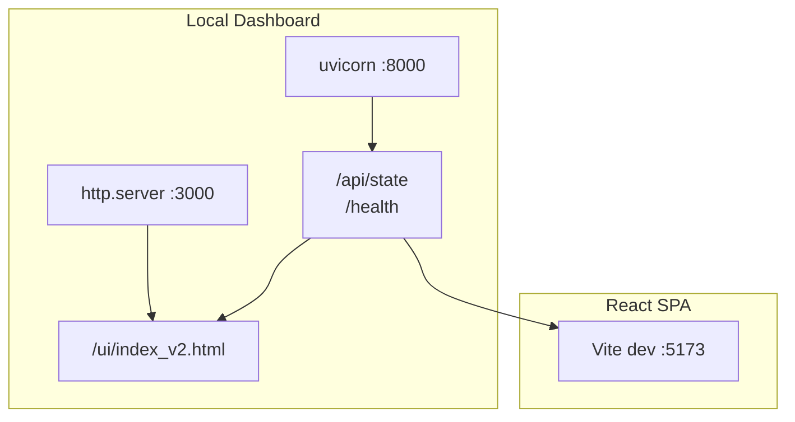
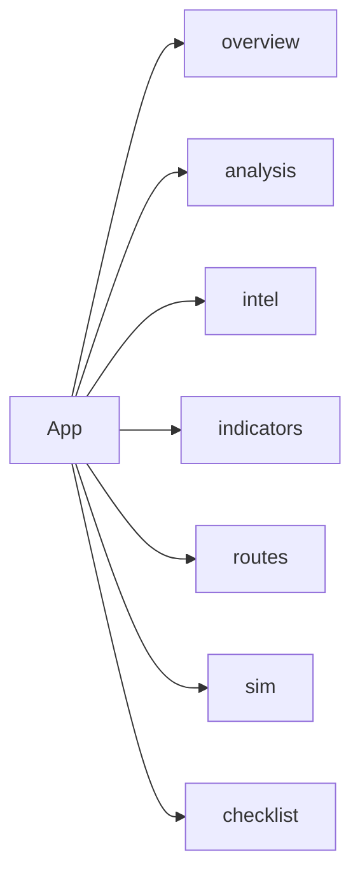

# Layout

UI 진입점, 탭 구조, 서빙 방식, 색상·타이포그래피·디자인 스타일·위치 상세.

---

## 서빙 아키텍처

---

## 탭 전환

탭 기반 UI, 라우터 없음. `useState("overview")` 등으로 탭 ID 관리.

---

## 서빙 구조

| 서비스 | 명령 | URL |
|--------|------|-----|
| API | `uvicorn src.iran_monitor.health:app --port 8000` | http://127.0.0.1:8000/api/state |
| Static UI | `python -m http.server 3000` | http://127.0.0.1:3000/ui/index_v2.html |
| React SPA | `cd react && npm run dev` | Vite 5173 |

통합 실행: `.\start_local_dashboard.ps1`

---

## UI 진입점

| 진입점 | 경로 | 설명 |
|--------|------|------|
| Static dashboard | `ui/index_v2.html` | CDN React + Babel, 단일 HTML 페이지 |
| React SPA | `react/index.html` + `src/main.jsx` | Vite SPA, Leaflet CSS + styles.css |

---

## 탭 구조

| Tab ID | 라벨 | 아이콘 |
|--------|------|--------|
| overview | Overview | 📊 |
| analysis | Trends & Log | 📈 |
| intel | Intel Feed | 🔴 |
| indicators | Indicators | 📡 |
| routes | Routes | 🗺️ |
| sim | Simulator | 🧪 |
| checklist | Checklist | ✅ |

---

## 데이터 소스

- `VITE_DASHBOARD_CANDIDATES`: Full sync 대상 URL 목록
- `VITE_FAST_STATE_CANDIDATES`: Fast poll 대상 URL 목록
- 기본값: GitHub raw `live/hyie_state.json`, `http://127.0.0.1:8000/api/state`, `/api/state` 등

---

## 색상 팔레트 (Color Palette)

| 용도 | HEX | 사용처 |
|------|-----|--------|
| 배경 최상위 | `#020617` | body, styles.css |
| 카드/패널 배경 | `#0f172a`, `#0b1220` | Card, Pill, Bar, 내부 패널 |
| 보더 | `#1e293b`, `#334155` | 테두리 |
| 보조 텍스트 | `#64748b` | 라벨, 서브텍스트 |
| 기본 텍스트 | `#94a3b8`, `#e2e8f0`, `#cbd5e1` | 본문, 강조 |
| 링크 | `#93c5fd` | a 태그 |
| Green (OK/OPEN) | `#22c55e` | Gauge low, status OPEN |
| Amber (CAUTION) | `#f59e0b`, `#fbbf24` | Gauge mid, warn |
| Red (BLOCKED/CRITICAL) | `#ef4444`, `#fca5a5`, `#f87171` | Gauge high, 에러 |
| Blue (active/선택) | `#60a5fa`, `#3b82f6` | 탭 active, Sparkline |
| 에러 배경 | `rgba(239,68,68,0.10)` | 에러 메시지 |
| warn 배경 | `rgba(245,158,11,0.06)` | Key Assumption warn |
| Tier 뱃지 TIER0 | `rgba(239,68,68,0.15)` / `#fca5a5` | |
| Tier 뱃지 TIER1 | `rgba(245,158,11,0.15)` / `#fcd34d` | |
| Tier 뱃지 TIER2 | `rgba(100,116,139,0.15)` / `#94a3b8` | |
| BLOCKED 루트 | `#7f1d1d`, `#14532d` | 루트 카드 border/badge |
| 차트 "no data" | `#475569` | Sparkline/MultiLineChart |

---

## 타이포그래피 (Font)

| 용도 | fontSize | fontWeight | fontFamily |
|------|----------|------------|------------|
| 헤더 타이틀 | 18 | 900 | inherit |
| 섹션 제목 | 13 | 900 | inherit |
| 큰 수치 | 20~24 | 900 | monospace |
| 본문 | 11~12 | (default) | inherit |
| 라벨 | 10~11 | 800 | inherit |
| monospace 수치 | 11~14 | 900 | monospace |

폰트 스택: Inter, system-ui, -apple-system, Segoe UI, Roboto, Arial, Apple SD Gothic Neo, Noto Sans KR, sans-serif

---

## 디자인 스타일

- **테마**: Dark mode (`color-scheme: dark`), slate/in navy 계열
- **카드**: `borderRadius: 12~16`, `padding: 12~18`, `border: 1px solid #1e293b`
- **버튼**: `borderRadius: 10~12`, `padding: 10px 12px`, `fontWeight: 900`
- **Pill**: `borderRadius: 999`, `padding: 6px 10px`
- **Bar**: `height: 8`, `borderRadius: 999`, 트랙 `#111827`
- **Gauge**: SVG 90x65, 반원 arc, 값에 따라 색상 동적 (`v>=0.8` red, `v>=0.4` amber, else green)

---

## 위치·레이아웃

| 영역 | 위치 | 레이아웃 |
|------|------|----------|
| App 전체 | `minHeight: 100vh`, `padding: 12`, `maxWidth: 980`, `margin: 0 auto` | 중앙 정렬, 좌우 패딩 |
| 헤더 | 상단, `marginBottom: 12` | `flex`, `justifyContent: space-between`, `gap: 12` |
| 탭 버튼 | 헤더 아래, `marginBottom: 12` | `flex`, `gap: 8`, `flexWrap: wrap` |
| Overview Gauge 그리드 | 첫 Card 내 | `gridTemplateColumns: 1fr 1fr 1fr` |
| Likelihood / Top routes | Overview | `gridTemplateColumns: 1fr 1fr` |
| Conflict Stats | 두 번째 Card | `gridTemplateColumns: repeat(auto-fit, minmax(190px, 1fr))` |
| Key Assumptions | 세 번째 Card | `gridTemplateColumns: repeat(auto-fit, minmax(260px, 1fr))` |
| Analysis 차트 | 3열: MultiLineChart + Sparklines | `MultiLineChart height=160`, Sparkline 220x44 |
| Intel feed | 카드 리스트 | `background: #0b1220`, `borderRadius: 12` |
| Indicator cards | 그리드 | `borderRadius: 12`, Bar + tier 뱃지 |
| Route cards | 수직 리스트 | `marginBottom: 10`, selected 시 `border: 2px solid #3b82f6` |
