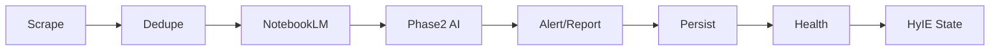
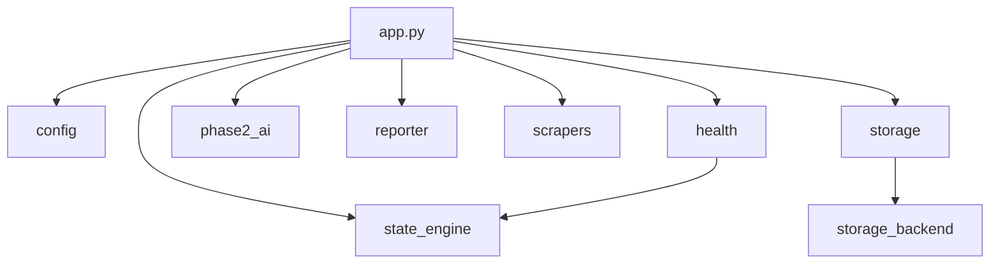
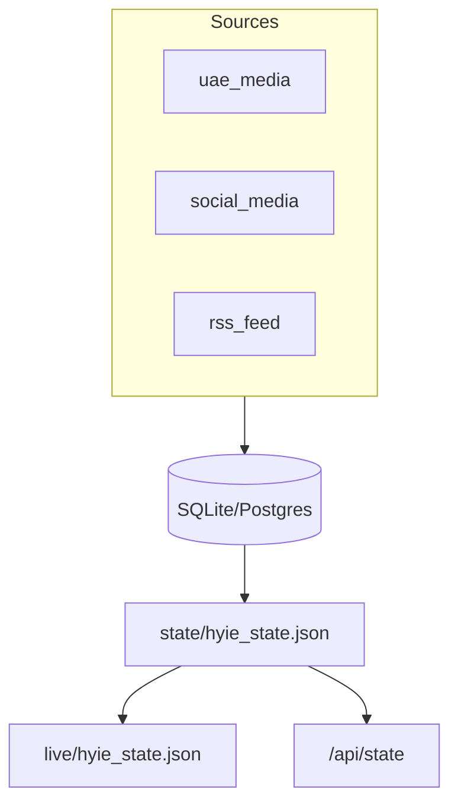

# System Architecture

UrgentDash Independent — HYIE 전황 실시간 모니터링. 30분 주기 업데이트. 정보 소스: NotebookLM.

---

## 개요

- **목적**: Iran-UAE 전황 모니터링, 대시보드 상태 제공
- **업데이트**: 30분마다 (GHA cron 7, 37분)
- **스택**: Python 3.11+, FastAPI, NotebookLM, React, SQLite/Postgres

---

## 파이프라인

1. **Scrape** — UAE media, social media, RSS (async `asyncio.gather`)
2. **Dedupe** — DB + in-memory dedup
3. **NotebookLM** — upload articles, analyze
4. **Phase2 AI** — `phase2_ai.analyze_with_notebooklm_or_fallback`, threat scoring
5. **Alert/Report** — immediate Telegram if HIGH/CRITICAL, periodic report, WhatsApp (Twilio)
6. **Persist** — SQLite/Postgres via `persist_run_backend`
7. **Health** — write `.health_state.json`
8. **HyIE State** — build and persist `state/hyie_state.json` (HyIE-ERC² payload)

---

## 진입점

| 진입점 | 경로 | 용도 |
|--------|------|------|
| Main | `main.py` | Root entrypoint, delegates to `src.iran_monitor.app` |
| Run now | `scripts/run_now.py` | One-shot run (`python scripts/run_now.py --telegram-send`), used by GHA |
| Monitor | `scripts/run_monitor.py` | Long-running scheduler; calls `main._run_serve` |
| Update state | `scripts/update_hyie_state_now.py` | Updates HyIE state without full scrape |
| Export live | `scripts/export_hyie_live.py` | Exports `state/hyie_state.json` → `live/hyie_state.json` |

---

## 모듈 의존성

| 모듈 | 경로 | 역할 |
|------|------|------|
| config | `src/iran_monitor/config.py` | Pydantic settings (Telegram, Twilio, storage, HyIE) |
| app | `src/iran_monitor/app.py` | Pipeline, scheduler (APScheduler), `hourly_job` |
| health | `src/iran_monitor/health.py` | FastAPI health/state API |
| state_engine | `src/iran_monitor/state_engine.py` | `build_state_payload`, `warming_up_payload` |
| storage | `src/iran_monitor/storage.py` | `ensure_layout`, `save_json`, `append_jsonl` |
| storage_adapter | `src/iran_monitor/storage_adapter.py` | `build_run_payload`, `build_article_rows`, `build_outbox_rows` |
| storage_backend | `src/iran_monitor/storage_backend.py` | SQLite/Postgres, dedup |
| reporter | `src/iran_monitor/reporter.py` | Telegram/WhatsApp |
| phase2_ai | `src/iran_monitor/phase2_ai.py` | NotebookLM analysis + fallback |
| route_geo | `src/iran_monitor/route_geo.py` | Route geo payload for dashboard |
| scrapers | `src/iran_monitor/scrapers/` | `uae_media`, `social_media`, `rss_feed` |
| sources | `src/iran_monitor/sources/` | Tier0/1/2 signals for HyIE |

---

## 데이터 흐름

---

## API 명세

FastAPI app: `src/iran_monitor/health.py`

| Endpoint | Method | 용도 |
|----------|--------|------|
| `/` | GET | API info and links |
| `/health` | GET | Pipeline health: status, last run, article count |
| `/api/state` | GET | HyIE-ERC² state (or warming_up payload) |
| `/api/state/egress-eta` | GET | Egress ETA (`egress_loss_eta_h`, etc.) |
| `/api/state/egress-eta` | POST | Set egress ETA (body: `egress_loss_eta_h`, `note`) |

서빙: `uvicorn src.iran_monitor.health:app --host 127.0.0.1 --port 8000`

---

## 상태 파일

| 경로 | 용도 |
|------|------|
| `state/hyie_state.json` | Runtime HyIE-ERC² payload |
| `state/egress_eta.json` | Egress ETA 사용자 설정 |
| `live/hyie_state.json` | GHA publish 대상 (urgentdash-live) |
| `live/last_updated.json` | 마지막 업데이트 시각 |
| `.health_state.json` | Pipeline health (root) |
| `state/monitor.lock`, `state/hyie_ingest.lock` | Lock files |

---

## GitHub Actions

`.github/workflows/monitor.yml`:

- **Schedule**: cron `7,37 * * * *` (UTC)
- **Steps**: Checkout → Python 3.11 → deps → Playwright → restore NotebookLM profile → `python scripts/run_now.py --telegram-send`
- **Publish**: on success, copy `state/hyie_state.json` → `live/hyie_state.json` on `urgentdash-live` branch
- **Artifacts**: `reports`, `state`, `ledger`, `.health_state.json` (retention 7 days)

---

## 디렉터리 구조

| 경로 | 용도 |
|------|------|
| `state/` | Runtime state: hyie_state, egress_eta, locks |
| `live/` | Dashboard output (urgentdash-live) |
| `reports/` | Date-based JSONL reports |
| `urgentdash_snapshots/` | Daily JSONL + hourly JSON snapshots |
| `db/` | SQLite DB (`iran_monitor.sqlite`) |
