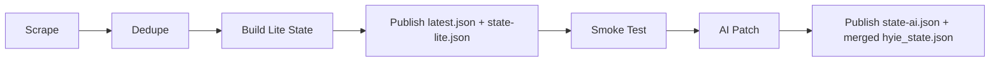
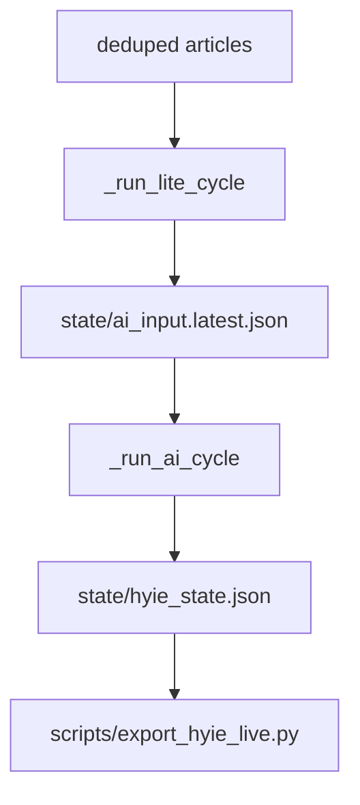
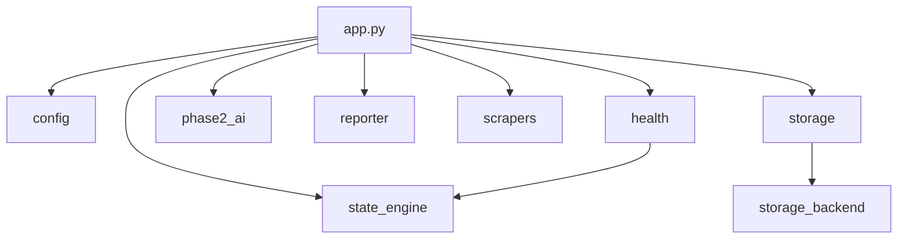

# System Architecture

UrgentDash Independent는 HYIE 전황 상태 생성과 AI 분석 주입을 분리한 delivery path를 기준으로 운영한다.

---

## 개요

- 목적: Iran-UAE 전황 모니터링과 대시보드 상태 제공
- 업데이트: GitHub Actions 15분 overschedule, 25분 freshness gate
- 스택: Python 3.11+, FastAPI, React, NotebookLM, SQLite/Postgres
- 배포 채널: `urgentdash-live` 브랜치 + GitHub Raw + React SPA

---

## 운영 파이프라인

1. Scrape: UAE media, social media, RSS를 비동기로 수집
2. Dedupe: DB + in-process dedup으로 신규 canonical article 결정
3. Lite: `_update_hyie_state(...)`로 canonical HYIE state 생성
4. Publish Lite: `live/latest.json`, `live/v/<version>/state-lite.json`, legacy `live/hyie_state.json` 생성
5. Smoke: publish 직후 raw `latest.json`과 versioned payload 검증
6. AI: `state/ai_input.latest.json`을 읽어 NotebookLM 또는 fallback으로 `ai_analysis` 생성
7. Publish AI: `live/v/<version>/state-ai.json`과 merged `live/hyie_state.json` 재발행

---

## hourly_job 모드 분리

`src/iran_monitor/app.py`의 `hourly_job(...)`는 세 가지 모드를 가진다.

| 모드 | 경로 | 용도 |
|------|------|------|
| `lite` | scrape → dedupe → build state → write AI input | delivery critical path |
| `ai` | read AI input → NotebookLM/fallback → inject `ai_analysis` | 비차단 AI patch |
| `full` | `lite` 후 `ai` 순차 실행 | 로컬 호환 / 단일 실행 |

세부 구현은 `_run_lite_cycle(...)`와 `_run_ai_cycle(...)`로 분리되어 있으며, `scripts/run_now.py --mode lite|ai|full`과 `main.py --mode ...`에서 직접 호출할 수 있다.

---

## AI 입력 흐름

`state/ai_input.latest.json`에는 아래 정보가 저장된다.

- `run_ts`
- `source_version`
- `counts`
- `flags`
- `new_articles`

이 파일은 런타임 handoff용이며 main 브랜치 커밋 대상은 아니다.

---

## 공개 payload 구조

| 경로 | 설명 |
|------|------|
| `live/latest.json` | pointer payload. `version`, `aiVersion`, `publishedAt`, `stateTs`, `aiMode`, `litePath`, `aiPath` |
| `live/v/<version>/state-lite.json` | canonical HYIE state without `ai_analysis` |
| `live/v/<version>/state-ai.json` | `{ ai_analysis, ai_mode, ai_updated_at, source_version }` |
| `live/hyie_state.json` | 하위호환 merged payload |
| `live/last_updated.json` | publish summary |

`version`은 lite state hash, `aiVersion`은 `ai_analysis` hash를 사용한다.

---

## 진입점

| 진입점 | 경로 | 용도 |
|--------|------|------|
| Main | `main.py` | root entrypoint, delegates to `src.iran_monitor.app` |
| Run now | `scripts/run_now.py` | one-shot run for `full`, `lite`, `ai` |
| Monitor | `scripts/run_monitor.py` | long-running scheduler |
| Export live | `scripts/export_hyie_live.py` | state → versioned live payload export |
| Publish branch | `scripts/publish_live_branch.py` | `live/` 디렉터리를 `urgentdash-live` 브랜치에 publish |
| Smoke test | `scripts/smoke_test_live.py` | raw `latest.json` 및 versioned payload 검증 |

---

## 모듈 의존성

| 모듈 | 경로 | 역할 |
|------|------|------|
| config | `src/iran_monitor/config.py` | runtime settings, mode, NotebookLM rotation, AI input path |
| app | `src/iran_monitor/app.py` | scrape/dedupe/publish pipeline, scheduler, health writes |
| health | `src/iran_monitor/health.py` | `/health`, `/api/state`, egress ETA API |
| phase2_ai | `src/iran_monitor/phase2_ai.py` | NotebookLM analysis + fallback |
| reporter | `src/iran_monitor/reporter.py` | Telegram/WhatsApp |
| storage_backend | `src/iran_monitor/storage_backend.py` | SQLite/Postgres persistence and dedup |

---

## Health 모델

`/health`는 기존 기본 필드를 유지하면서 운영용 필드를 추가로 노출한다.

- `last_scrape_success_at`
- `last_state_success_at`
- `last_ai_success_at`
- `last_publish_success_at`
- `current_version`
- `published_version`
- `ai_mode`
- `ai_version`
- `source_lag_seconds`
- `degraded_reasons`
- `last_smoke_test_at`
- `last_smoke_test_status`

상태 판정은 lite publish와 ai 결과를 분리한다.

- lite 성공 + ai fallback/실패: `degraded`
- lite 실패: `error`

---

## GitHub Actions

`.github/workflows/monitor.yml`

- Schedule: `7,22,37,52 * * * *`
- Concurrency: workflow 단위 단일 실행
- Freshness gate: 마지막 `publishedAt`이 25분 이내면 lite 생략
- Lite 단계: `python scripts/run_now.py --mode lite --telegram-send`
- Publish 단계: `python scripts/export_hyie_live.py --publish-mode lite` 후 `urgentdash-live` 브랜치 publish
- Smoke 단계: raw `live/latest.json` fetch → schema + freshness 검증
- AI 단계: NotebookLM auth restore/validate 후 `python scripts/run_now.py --mode ai --telegram-send`
- AI publish는 workflow 전체의 availability를 막지 않음

NotebookLM 인증이 만료되면 AI는 fallback으로 내려가며, 운영에서 NotebookLM을 다시 쓰려면 `nlm login` 또는 `NLM_COOKIES_JSON` / `NLM_METADATA_JSON` 갱신이 필요하다.

---

## 디렉터리 구조

| 경로 | 용도 |
|------|------|
| `state/` | runtime state, locks, `ai_input.latest.json` |
| `live/` | local/export output for urgentdash-live publish |
| `reports/` | date-based JSONL reports |
| `urgentdash_snapshots/` | daily JSONL + hourly JSON snapshots |
| `db/` | SQLite DB |
